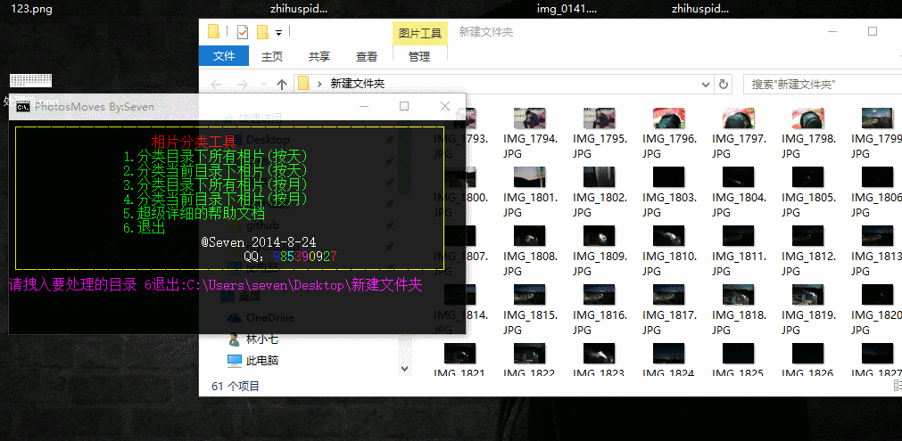

# MovePhotos

## 1. 一个Win批处理的图片日期分类工具
1. 支持按月分类图片
2. 支持按天分类图片
3. 支持深层目录处理
4. 支持winxp win7 win8 win10，不依赖任何第三方工具

## 2. 效果图


## 3. 将代码直接copy到记事本，修改扩展名为bat，双击即可运行。

```bat
@echo off&&setlocal enableextensions
title PhotosMoves By:Seven&&color 0D
MODE CON COLS=64 LINES=15
set  mycolor="9ABCDEF"
set "sevens=call :seven"&&set "end=@echo."
set myName=%~n0
if "%myName%" neq "se7en" (
		@echo. &&@echo.&&@echo               文件部分~损~坏，请将文件名修改为se7en后方可正常运行。
		@echo. &&@echo.&&@echo              自动修复中ing完成...任意键重新启动。
		@echo.         &&%sevens% D "                      By@林小柒   QQ："&&%sevens% 9 "9"&&%sevens% A "8"&&%sevens% B "5"&&%sevens% C "3"&&%sevens% D "9"&&%sevens% E "0"&&%sevens% F "9"&&%sevens% A "2"&&%sevens% C "7"
		rename %0 se7en.bat
		pause>nul
		se7en.bat&exit
	)
:f
goto main
:k
set /p select="请选择要处理的类型:"
if "%select%" == "1" goto f1
if "%select%" == "2" goto f2
if "%select%" == "3" goto f3
if "%select%" == "4" goto f4
if "%select%" == "5" goto f5
if "%select%" == "6" exit
goto f
:f1
for /r %%a in ("*.jpg") do set "t=%%~ta"&&call :movesByDd "%%a" %%t%%
goto :dels
:f2
for %%a in ("*.jpg") do set "t=%%~ta"&&call :movesByDd "%%a" %%t%%
goto :dels
:f3
for /r %%a in ("*.jpg") do set "t=%%~ta"&&call :movesByMm "%%a" %%t%%
goto :dels
:f4
for %%a in ("*.jpg") do set "t=%%~ta"&&call :movesByMm "%%a" %%t%%
goto :dels
:f5
@echo 把这个文件放到你要处理相片的目录下运行>D:\help.txt
@echo 会按照照相的日期生成文件夹并且按照日期对相片进行移动或者分类>>D:\help.txt
start notepad.exe "D:\help.txt"
goto k
:dels
for /f "delims=" %%s in ('dir /s /ad /b') do rd /q "%%s" 2>nul 1>nul
del /f /q "C:\help.txt" 2>nul 1>nul
goto f
:movesByDd
set dates=%2&&call set dates=%%dates:/=-%%
md %dates% 2>nul 1>nul
move %1 %dates%
set /a p=p+1
goto :eof
:movesByMm
set dates=%2&&call set dates=%%dates:/=-%%&&call set dates=%%dates:~0,7%%
md %dates% 2>nul 1>nul
move %1 %dates%
set /a p=p+1
goto :eof
:main
cls
%sevens% E "┌─────────────────────────────┐"&&%end%
%sevens% E "│"&&%sevens% C "                  相片分类工具"&&%sevens% E "                            │"&&%end%
%sevens% E "│"&&%sevens% A "              1.分类目录下所有相片(按天)"&&%sevens% E "                  │"&&%end%
%sevens% E "│"&&%sevens% A "              2.分类当前目录下相片(按天)"&&%sevens% E "                  │"&&%end%
%sevens% E "│"&&%sevens% A "              3.分类目录下所有相片(按月)"&&%sevens% E "                  │"&&%end%
%sevens% E "│"&&%sevens% A "              4.分类当前目录下相片(按月)"&&%sevens% E "                  │"&&%end%
%sevens% E "│"&&%sevens% A "              5.超级详细的帮助文档"&&%sevens% E "                        │"&&%end%
%sevens% E "│"&&%sevens% A "              6.退出"&&%sevens% E "                                      │"&&%end%
%sevens% E "│"&&%sevens% F "                         @Seven 2014-8-24"&&%sevens% E "                 │"&&%end%
%sevens% E "│"&&%sevens% F "                               QQ："&&%sevens% 9 "9"&&%sevens% A "8"&&%sevens% B "5"&&%sevens% C "3"&&%sevens% D "9"&&%sevens% E "0"&&%sevens% F "9"&&%sevens% A "2"&&%sevens% C "7"&&%sevens% E "              │"&&%end%
%sevens% E "└─────────────────────────────┘"&&%end%
if defined p echo ok.成功的分类了 %p% 张相片&&set /a p=0
set files=nul
set select=nul
if not defined "%files%" set /p files="请拽入要处理的目录 6退出:"
if "%files%" equ "6" exit
if not exist "%files%" @call %sevens% A 文件路径不存在,任意键继续&&pause>nul&&goto main
for %%a in ("%files%") do set "b=%%~aa"
if defined b (if %b:~0,1% neq d (@echo 拽入的不是目录,任意键继续&&pause>nul&&goto main ))
cd /d "%files%"
goto k
:seven
pushd "%temp%"&set/p= <nul>"%~2"&findstr /a:%~1 .* "%~2" nul&del "%~2"&popd
````


# 吾爱Java(QQ群):[170936712（点击加入）](http://shang.qq.com/wpa/qunwpa?idkey=694d83bb41622aeebf80a3e81aba883e8fb59bab386000ba403efb603af08fbc)